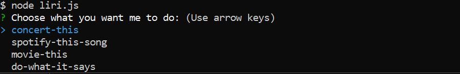
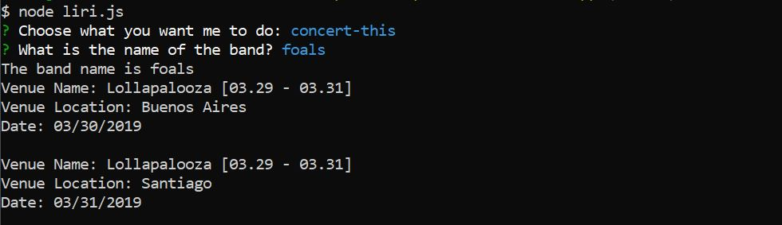
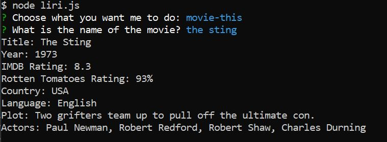
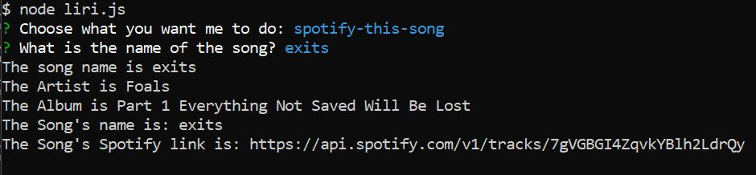
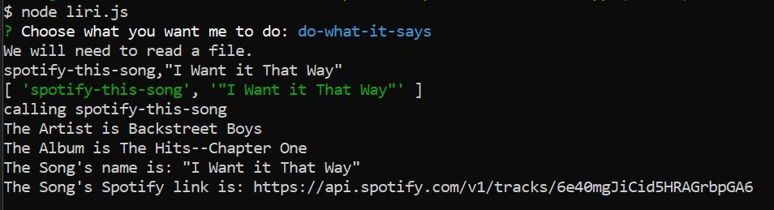

# tri-node-app
This command line app is a Language Interpretation and Recognition Interface. It will search Movies, Songs,  and Concerts.

## Instructions
1. Run npm install 
2. Place your spotify api key inside a file called .env  
SPOTIFY_ID=your-spotify-id  
SPOTIFY_SECRET=your-spotify-secret
3. Enter the command "node liri.js"
4. You will be prompted to select from a menu of tasks. Use the up and down arrows to maneuver the menu.

5. If you select concert-this, you will be prompted to enter a band. 

6. If you select movie-this, you will be prompted to enter a movie name. 

7. If you select spotify-this-song, you will be prompted to enter a song name. 

8. If you select do-what-it-says, you will not be prompted. The app will read it's directions from the local file called random.txt.

## Technology
* This app uses a npm package called inquirer to create command line prompts. 
* It uses a npm package called axios to make AJAX requests to the following APIs: OMDB and Bands In Town.
* It uses a npm package called dotenv to hide the Spotify api key.
* This app uses a npm package called moment to format time data.
* It uses a npm package called node-spotify-api to make a AJAX call to the spotify api.
* The npm package fs is used to read the random.txt file.

